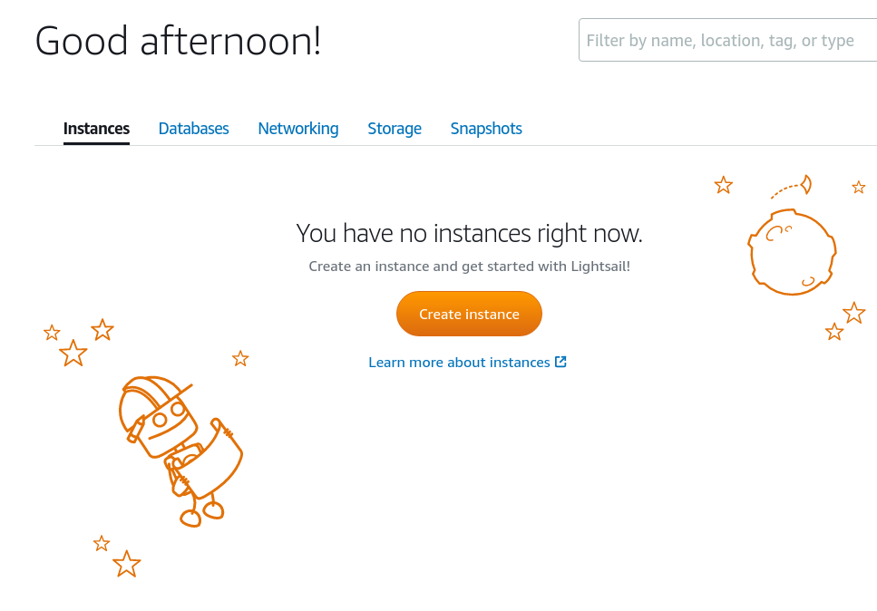
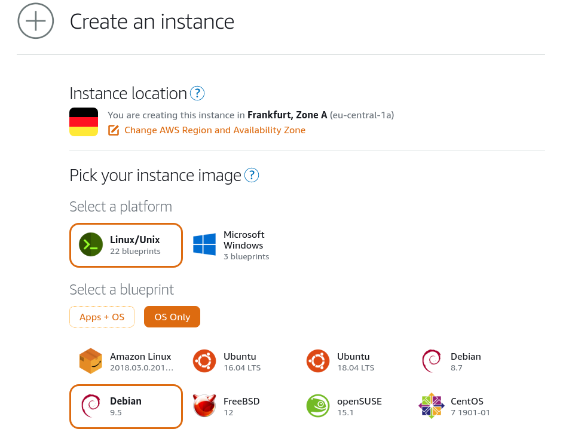
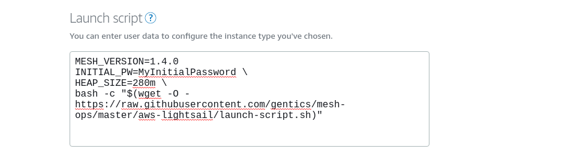
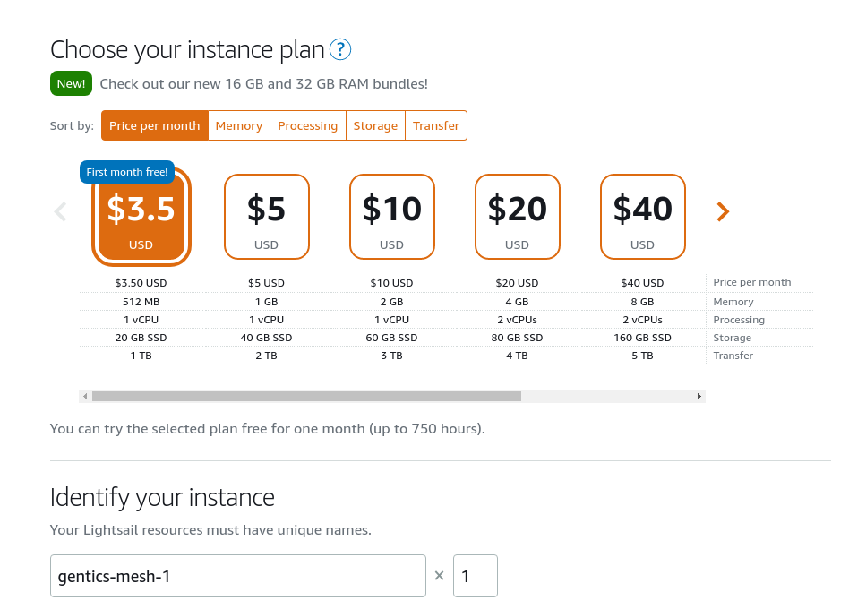

# Gentics Mesh On AWS Lightsail

This guide explains how to use [AWS Lightsail](https://aws.amazon.com/lightsail/) with [Gentics Mesh](https://getmesh.io). With lightsail you are able to host your own Gentics Mesh server for as low as $3.5 per month.



## Create Instance

The setup script is tailored for Debian Linux 9.5. Please select **Linux/Unix** → **OS Only** → **Debian 9.5**



## Launch Script
Enter the launch script which will setup the instance and install Gentics Mesh.

```bash
MESH_VERSION=1.4.0
INITIAL_PW=MyInitialPassword \
HEAP_SIZE=280m \
bash -c "$(wget -O - https://raw.githubusercontent.com/gentics/mesh-ops/master/aws-lightsail/launch-script.sh)"
```
The environment variables can be used to configure various aspects of the installation.



## Sizing

Next you need to select you instance plan.

If you plan to select a larger instance you should also increase the `HEAP_SIZE` setting in the launch script.




## Setup

The initial setup of the instance and Gentics Mesh can take 2 to 5 minutes depending on the speed of the instance.

The server will be accessible on port 80.

Finally you should be able to log-in to your instance with the provided IP.