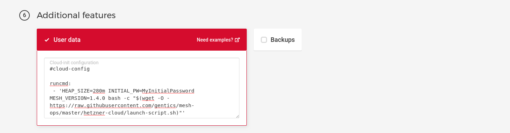
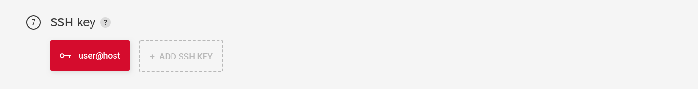

# Gentics Mesh On Hetzner Cloud

The [Hetzner Cloud](https://www.hetzner.com/cloud) service allow you to start a Gentics Mesh instance for as little as 2.99€ per month.

## Create Project


## Add SSH Key

In order to access the instances via SSH you need to add your SSH key in the Hetzner cloud interface. Depending on your setup you need to add your `id_rsa.pub` file.

## Configure Instance

For the Image you need to select **Debian 10**.


Additional volumes or networks are not needed / covered by this guide.


## (6) Additional features

Add the *cloud-init* configuration as **User data* within the **Additional features** section.

```bash
#cloud-config

runcmd:
 - 'HEAP_SIZE=280m INITIAL_PW=MyInitialPassword MESH_VERSION=1.4.0 bash -c "$(wget -O - https://raw.githubusercontent.com/gentics/mesh-ops/master/hetzner-cloud/launch-script.sh)"'
```



## (7) - SSH key

Ensure that your previously created key has been selected.



## (8) - Name

Name your instance


## Instance 

The setup of your instance may take 2 to 5 minutes depending on the speed of the setup process.
